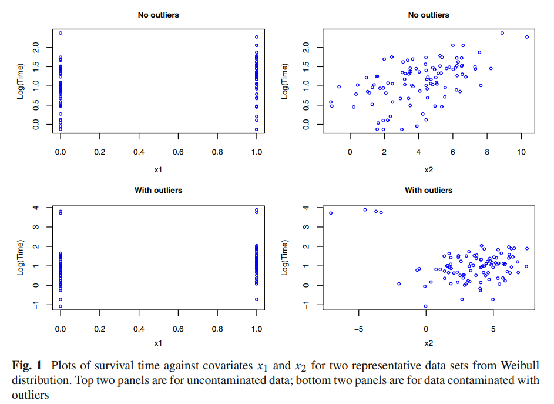
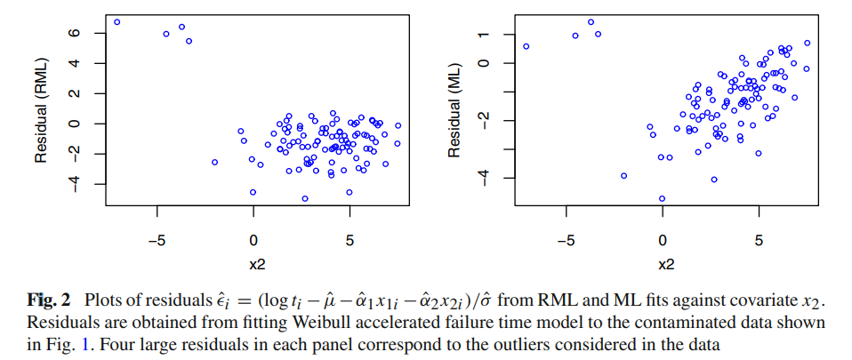
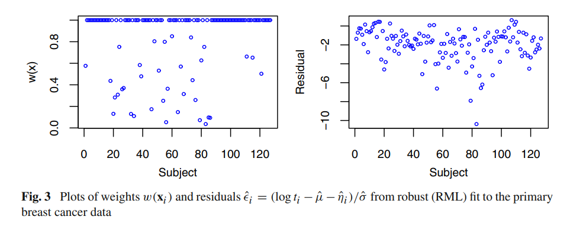
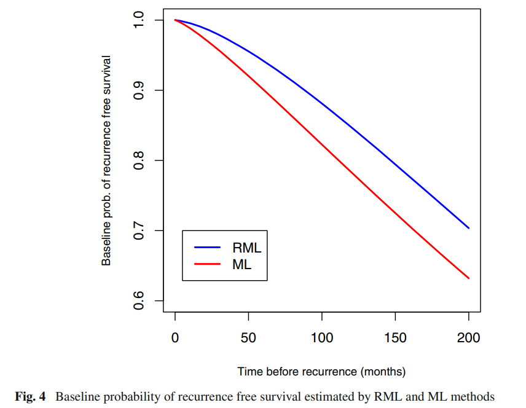

\section{Introduction}

When considering lifetime data with covariates, information (characteristics) is given by these covariates that have an effect on an individual's lifetime. The interest of a subject is survival time, may include characteristics such as age, sex, the severity of disease, smoking status, results of blood tests, and other laboratory data. In all, with the covariates introduced to the statistical model, it is expected that better production of lifetimes and thus, efficient analysis of the study can take place. Analogous to other statistical models, covariates can be quantitative or categorical. In most cases, the goal is to introduce covariates, to parametric models. Where through analysis, it can be verified that the assumed distribution(s) are reliable for the set of covariates given.

Incorporating covariates into the traditional linear regression model is one of several ways. Here we have that the residuals are normally distributed with mean zero and variance $\sigma^2$ and that the response variable is normally distributed with mean $\mu$ and variance $\sigma^2$. Considering the Weibull distribution, there are 2 forms in which a regression model can be formed.

Start by noting the the pdf of the Weibull distribution as 
\begin{equation}
   S(t) = e^{-(\frac{t}{\alpha})^\eta}
\end{equation}

The first form derived from Weibull distribution has that scale parameter $\alpha$ depending on $x$. 
$$S(t) = e^{-(\frac{t}{\alpha(x)})^\eta}$$ 
To get the second form, let $\alpha(x) = e^{\beta'x}$. Then we have the survival and hazard function, respectively as
\
\begin{equation}
   S(t;x) = e^{-(te^{-\beta'x})^\eta}
\end{equation}

\begin{equation}
   h(t;x) = \eta t^{\eta -1}e^{(\eta \beta)'x}
\end{equation}


Most of the robust developments and the one popular for analysis among those in biomedical sciences make use of the semi-parametric Cox's proportional hazards model. In eq 1, the perspective used resulted in proportional hazard, now of consideration is that the defining property is proportional hazards. This has an effect on how the covariates are also introduced. Thus, this gives a regression model for lnh. 

Other considerations stem from introducing the covariates such that it acts on different characteristics of a model that can produce a different model. Instead of the proportional hazards function, use the proportional odds model to get a linear model for log odds. In other words, the result is logistic regression. The effect of the covariates, $x$ is to accelerate or decelerate the time scale $t$ as $(te^{\beta' x})$.

$$S(t;x) = e^{-(te^{\beta' x})^\eta}$$ 


When the goal of the study is to produce an analysis based on regression models for lifetime data with covariates we can apply the accelerated lifetime model The accelerated failure time model describes a situation where the subject's history of an event is accelerated. This subject can be of a biological or mechanical nature.

Popular in practice because it supports various survival models. It is usually chosen in contrast to proportional hazards models where a distribution may be useful to the model. Its use requires the assumption of a probability distribution. To assume such an application, one must access which distributions fit the data best. With that it requires precise specifications, otherwise, it is expected for it to be an insufficient model. With covariates being the main component of accelerated lifetime models, accelerated lifetime regresses the logarithm of these covariates. Where many find it useful when analyzing censored survival data.

The motivation of this paper stems from the sensitivity of outliers when modeling. Like traditional regression, outliers are of importance to survival analysis. They tend to be more sensitive to the most influential observations. With that, the goal of the paper is to construct a method where outlier observations are rejected or down-weighted.

The main problem that is being raised in this study is that outliers in cox regression models result in sensitive estimators. Note outliers tend to tell truth about the data, and it may be necessary to investigate what may have happened when the data was recorded. Nevertheless, investigations could be lengthy or inconclusive so proceeding with robust estimation via a robust maximum likelihood estimator should be feasible so long as its use gives a model where outliers have been detected and are given less weight. In the past 30 years, there has been extensive development regarding robust methods that utilized the semi-parametric Cox proportional hazards model. Generally speaking, these methods were robust against outliers in survival times but not against potential outliers in covariates.
Dr. Sinha proposes the use of a parametric accelerated failure time model. With the aim to produce a parametric accelerated failure time model that can handle outliers in 2 settings -- survival outcome variable and covariates.

[@outlierDetection] have researched the detection of outliers in Cox proportional hazard models based on the concordance c-index and named the method Dual Bootstrap Hypothesis Testing (DBHT). The c-index is analogous to the receiver operating characteristic (ROC) curve, where interest is in the sensitivity and specificity of a model. When outliers are present the c-index lowers and thus suggests the model is sensitive.

Dual Bootstrap Hypothesis Testing is an improvement on Bootstrap Hypothesis Testing (BHT). BHT is a method that removes a single observation from the data set and analyzes the c-index to signal outliers (and inliers) in a Cox Proportional hazards model. It has been discovered that BHT increases the number of outliers, so DBHT aims to provide a solution. Note that, bootstrapping is a resampling technique that aims to uncover the true distribution given by the data (rephrase a little). DBHT takes two bootstrap samples, where the 'poison' sample comes from the original data set and the 'antidote' is taken where one observation is removed from the original data set. Both samples are then compared via p-values. This is a test to see if an observation is "poison" (outlier). The test between the two samples gives a null hypothesis that the expected c-index of the "antidote" sample is greater than that of the "poison" sample. Whereas the alternative hypothesis would be that the expected c-index of the "antidote" sample is less than or equal to that of the "poison" sample. The p-values are calculated via the two-sample t-test (Welch's t-test) for unequal variances. Such a method requires high computing power. 

#### Example

```{r eval=FALSE, include=FALSE}
# install.packages('emplik')
# install.packages('survBootOutliers')
# install.packages("BiocManager")
# 
# BiocManager::install("BiocParallel")

```

```{r eval=FALSE, include=FALSE}
library(emplik)
# data(myeloma)
# colnames(myeloma) <-  c('time', 'status', 'logBUN', 'hgb', 'platelet', 'age', 'logWBC', 'FRAC', 'logPBM', 'protein', 'SCALC')
# head(myeloma)

```


```{r echo=TRUE, warning=FALSE, results= 'hide'}
library("survBootOutliers")

## Dual Bootstrap Hypothesis Test "dbht" with 50 bootstrap samples,
## each with 50 individuals and running on all available cores.
whas <- get.whas100.dataset()
outliers_dbht <- survBootOutliers( 
   surv.object=Surv(time = whas$times,event = whas$status ), 
   covariate.data = whas[,2:5], 
   sod.method = "dbht",
   B = 50, 
   B.N = 50,
   parallel.param = BiocParallel::SnowParam()
)


# outliers_dbht <- survBootOutliers( 
#    surv.object=Surv(time = whas$times,event = whas$status ), 
#    covariate.data = whas[,2:5], 
#    sod.method = "dbht",
#    B = 1000, 
#    B.N = 50,
#    parallel.param = BiocParallel::MulticoreParam() 
# )

```
```{r}
outliers_dbht$outlier_set[1:10,]

dbht<-as.data.frame(outliers_dbht$outlier_set)# convert to a dataframe (more easy to handle)
names(dbht)[1]="id" # change the name of the 1st) column
dbht.order<-dbht[order(dbht$id),]
dbht.order[1:10,]
```

```{r}
hist(outliers_dbht$histograms[[1]][[1]], main="antidote (blue) vs poison (gray)", col = "blue")
par(new = TRUE)
hist(outliers_dbht$histograms[[1]][[2]], main = "", xaxt='n')
```
Although both samples do not fit the Cox proportional hazards well, the "poison" sample indicates that it tends to have data that is most relevant to that of the assumed model. 


\section{Model, notation, and method}

\subsection{The log-linear form of the accelerated failiure time model}

Accelerated failure time models include exponential, Weibull, log-normal, and log-logistic distributions. The purpose for using an accelerated life time model stems from the assumption that the covariates on a subject are accelerated (tends to multiply) in regards to time rather than hazards (proportional hazards model). In other words accelerated lifetimes can be applied when interest in analyzing the speed of progression of a disease over time. Equation (1) gives the general accelerated failure time model. Here we start by understanding the surivival and hazard functions for the i-th individual. Note, $i = 1,\dots, n$ individuals and $j = 1,\dots p$ covariatesfor the i-th individual, the baseline survivor function as $S_0*(t)$, and baseline hazard function at time $t$ can be notated as $h_0*(t)$. Hence, we have 
$$S_i(t) = S_0 (\frac{t}{\alpha_1 x_{1i} + \cdots + \alpha_p x_{pi}}) = S(t;x) = e^{-(te^{-\beta'x})^\eta}$$


$$h_i(t) = e^{\alpha_1 x_{1i} + \cdots + \alpha_p x_{pi}}h_0(\frac{t}{\alpha_1 x_{1i} + \cdots + \alpha_p x_{pi}}) = h(t;x) = \eta t^{\eta -1}e^{(\eta \beta)'x}$$

As previously discussed, the accelerated life time models can be parameterized in various ways. Here we consider a log-linear form, which results in a form similar to that of a linear regression. It can be denoted.

\begin{equation}
   ln t_i = \mu + \beta'x +\sigma \epsilon_i
\end{equation}

Producing the respective surivivor and hazard functions
$$S_i(t) = S_{\epsilon_i} (\frac{ln t - \mu - \eta _i}{\sigma})$$

$$h_i(t) = \frac{1}{\sigma t} h_{\epsilon_i} (\frac{ln t - \mu - \eta _i}{\sigma})$$

It follows that accelerated life time model has a double property as Weibill also follows a proportional hazards distribution. The other models that can be considered come from log-normal and log-logistic distributions.

\subsection{Robust Estimation}

Robust estimation can be defined as a method that is not influenced by slight differences of the proposed assumptions (ie., probability distribution). As a consequences it optimizes the algorithms search for a robust estimator. In other words, the results obtained are deemed to be reliable given these slight variations. In general, maximum likelihood estimates, linear combinations and statistical rank tests can aid in achieving robust estimation. Here, of interest is estimating the model parameters $\mu$, the row vector of scale $\alpha = \alpha_1, \dots \alpha_p$, and $\sigma$. To do this asuitable robust method via maximum likelihood estimation is required. One that is resistant to potential outliers in both survival times and covariates in the data.

Estimations of parameters can be derived via the standard maximum likelihood method. The i-th sigma denotes the censoring status of the i-th survival time. From here, inference can proceed as follows from the maximum likelihood theory. It is the likelihood score that is a function of error terms and covariates that are unbounded for both the survival time ti and covariates x_i. It has been discovered  that this construction is not robust to outliers (sensitive to outliers). Therefore the motivation of this literature comes from this issue. Dr. Sinha proposes that the solution for this includes the Huber-type monotone psi function on the error terms to bound the influence of outliers. Explain more about Huber-type monotone psi function, (@robustStatistics)


\subsection{Asymptotics}

The author provides a sketch of the asymptotic properties needed for estimating the parameters of interest. Recall, by the term asymptotic leads to determine the properties that are assumed to correct when dealing with a large sample. Expectation using the mean value theorem. Normality if the estimator is properly behaved, then the central limit properly can be applied. Covariance

\subsection{Robust estimation in Weibull accelerated failure time models}


Review of the log-linear form of the accelerated failure time model. With the baseline hazard function concerning the Weibull distribution, the scale and shape parameters are constructed differently. More specifically, with log-linear form, we can visualize the error terms as the Gumbel distribution. The Gumbel can be denoted as an extreme value (type 1) and is a member of the exponential family. Traditionally its purpose lies with modeling the distribution of the maximum number of samples of various distributions. With the Weibull, it is the log-Weibull distribution. When latent (inferred) variables are considered it has then been discovered by Gumbel that these are the error terms of the log-linear model.

Robust maximum likelihood is used to numerically solve the estimating equations. The central idea behind iterative methods is the use of an initial value and subsequent approximations that improve at each iteration until a specified error bound is met. Here other iteration methods could have been considered. For instance, the secant method, newtons method, or Bisection method. Some characteristics distinguish the Newton-Raphson method from the others. The first is that it deals with extrapolation, in which the goal of this survival analysis is to predict values that fall outside the range of data. This is clear by definition of an accelerated failure time model, where interest is in analyzing the effects of covariates on a subject's lifetime (ie., how much longer they will live given qualitative or quantitative characteristics?). Next, the Newton-Raphson method is fast and suitable when the first and second derivatives are convenient to find. Such a method is called a root-finding algorithm where interest is in finding a value such that it takes the function to be zero.

The initial estimates are derived from first-order Taylor series expansion which is used to get the initial estimates. Therefore the iterative equations until convergence can be obtained. As a consequence, a $(p+2)×(p+2)$ matrix is produced for the objective function. It is the equations given by the components, where the Huber psi function is imposed. Note that it can be tuned. Approximate variances were obtained from the sandwich-type variance-covariance matrix. ie, 
$$V(\hat{\theta}) = M^{-1}QM^{-1}$$.

, where $\hat{\theta}$ is an estimate of $(\mu, \alpha, \sigma)'$. 

\subsection{Robust estimation in log-normal accelerated failure time models}

If $T ~ log-normal$, then accelerated failure time models has associated location ($\mu + \eta_i$) and scale parameter ($\sigma$). The error terms follow a standard normal distribution. The standard maximum likelihood estimators are displayed, then the robust approach. Which thereafter can be solved numerically using the Newton-Raphson method. Expectations and covariance are in respect to the standard normal distribution. Note the general form of log-normal is 
$$\frac{1}{x\sigma \sqrt{2\pi}}e^{- \frac{ln x - \mu}{2\sigma^2}}$$


\subsection{Robust estimation in log-logistic accelerated failure time models}

If $T ~ log-logistic$, then the parameters are $\tau - \kappa \eta _i$ and $\kappa$, where $\tau = -\frac{\mu}{\sigma}$ and $\kappa = \frac{1}{\sigma}$ in log-linear form as in eq (). Note the general form of log-logistic (shifted) is 
$$\frac{(1+c*(\frac{x-\mu}{\sigma}))}{\sigma(1+(1+c*(\frac{x-\mu}{\sigma}))^{-c})^2}$$


\section{Simulation study}

Two sets of data are compared against each other. A set in which no outliers were considered in the data. Another set, where the data is altered and polluted with outliers (additional noise). Next of consideration is the performance of these sets under ML and RML. An informal way of detecting outliers is by a residual plot. Both residual plots clearly show four outliers are present. The plots suggest RML is not as influenced by these outliers as much as that for estimation under ML. The actual values tend to be more than the predicted values (positive trend).




To formally access whether this interpretation is feasible, empirical results such as biases, mean squared errors, coverage probabilities, and average lengths of 95% confidence intervals are closely examined using Monte Carlo simulations. Note, coverage probabilities refer to the proportion of random regions (intervals) in regards to the time that will contain the true value.

First, the empirical results are analyzed in Weibull models. When there are no outliers, the maximum likelihood (ML) estimator has a lower mean-squared error than the robust maximum likelihood (RML). This is okay (not a cause for concern) since the focus is on data with outliers -- expected in practice --  [see Table 1 in @mainStudy]. In contrast, one can argue that this is a cause for concern, which implies the importance of conducting such a comparison between the two methods. As it should not be overlooked that there exists and a number of data that where ML outperforms RML by larger margins. Adding a single outlier clearly suggests that ML begins to produce larger mean squared errors, larger biases, and lower coverage probabilities than the estimators produced by robust maximum likelihood (RML). Now with a 4% (of n = 100) outlier, RML has some biases but it is much more severe in the case of ML. When the sample size is increased, it can be shown that the respective estimators do much better under the weak law of large numbers (WLLN) but RML generally outperforms the ML method. Recall, WLLN refers to the average of a sequence (large samples) of independent and identically distributed (iid) random variables with a common mean and variance that converges in probability to the true value [see Table 3, Table 4 in @mainStudy].

In regards to log-normal models, it is again determined that when outliers are assumed to present in the data, then the RML outperforms the ML method [see Table 5 and 6 in @mainStudy].

Considering the log-logistic models, the conclusions mentioned for the other two models are consistent. More specifically, the ML method of estimating the first regression parameter is not as sensitive to outliers. When the sample size is increased, although the bias and MSE decrease at a constant rate for both estimators, the RML exceeds the ML. 

A reviewer of this study provided feedback that distinguished between moderate and extreme outliers. This insight can be interpreted as the question; how well does the robust method in this paper perform under extreme outliers. Real-life data can contain any number of outliers. More plausible would be a number of moderate outliers and a few extreme outliers. Knowing the amount of moderate or extreme outliers could help in the construction of the RML. To address this concern, Dr. Sinha suggests that the robust method would remain more reliable than that of the standard ML.

```{r eval=FALSE, echo=TRUE}
# TODO: finish simulation

# create covariates
x1 <- sample(c(0,1),100,replace=T)
x2 <- rnorm(100, mean = 4, sd = 2)

# data 
data_weibull <- rweibull(46, shape = 1, scale = 1)

```


\section{Application: breast cancer data}
The data was presented in a previous study of survival analysis. A residual analysis by the assumed parametric distribution resulted in all models performing similarly. Although, due to the Weibull model having the double property of accelerated lifetimes and proportional hazards it was chosen. We then have the log-linear form as

\begin{aligned} 
\log (\text {TIME}) = \mu + \alpha _1 \text {SBR} + \alpha _2 \text {Node} + \alpha _3 \text {Tumor} + \alpha _4 \text {ER} + \alpha _5 \text {PR} + \sigma \epsilon 
\end{aligned}

Concerning the data itself, the author suggests by the residual plots that outliers in regards to covariates exist and by the baseline probability survival there exist extreme outliers in regards to recurrence times. Hence, the RML method is valid to use, and conducted analyses are more so valid than ML. 
When comparing the two methods further, the location parameters are similar, but RML provides a smaller standard error. With the scale parameter, the results are slightly different. Similarly for the estimates of the coefficients. But the RML method produces smaller standard errors. The author suggests that the residuals.






\section{Discussion}
Dr. Sinha, remarks that the RML method may be extended to frailty models. It would be interesting to review for my studies how this can be done. While reviewing this paper I noticed that there was not much comparison between the previous research of robust method. It would be sufficient to see whether other robust methods that have been "discovered" do not handle outliers in covariates sufficiently. This could be a potential extension of studying this paper. As for practicality, I'm interested in implementing the robust method proposed with R. Then possibly contacting Dr.Sinha to review the correct implementation. As seen above, I have tried to add other practical components to this study. Where I looked into using the double bootstrap hypothesis test and Monte Carlo simulation in R. Studying Monte Carlo simulations would be great to learn so I better follow along as I study other research papers in the future
\section{References}
